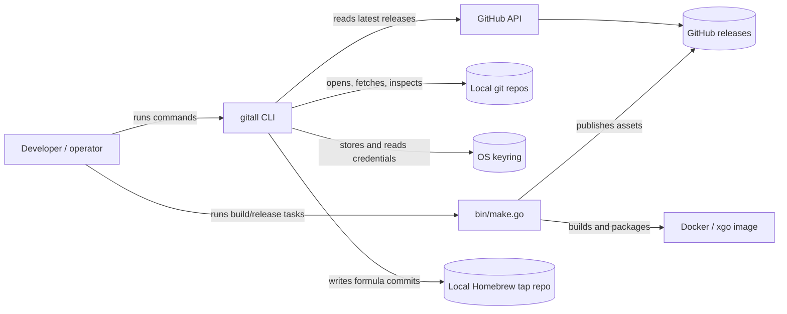

# System Context

`gitall` is a local command-line utility for developers and operators who keep several git repositories checked out on one workstation. The repo boundary is the CLI, its build/release helper, and the documentation and task records needed to maintain them.

## Structural View

## Main Code Areas

- `cmd/`: user-facing Cobra CLI commands and shared repository/auth helpers.
- `bin/`: Go and shell build, packaging, distro, and release helpers.
- `docs/runbooks/`: durable operator procedures.
- `tasks/`: committed work state and future ideas.
- `build/` and `dist/`: generated release/build artifacts.
- `vendor/`: vendored Go dependencies.

## External Dependencies

- Local git repositories on disk.
- Git remotes, usually GitHub `origin` remotes.
- SSH private key material and passphrases for remote fetches.
- Local keyring service named `gitall`.
- GitHub API credentials for release and repository metadata in `updatetap`.
- Docker, GitHub CLI, and packaging tools for release workflows.

## Non-Goals

- `gitall` is not a general git porcelain replacement.
- `gitall` does not host or synchronize repository state centrally.
- `gitall` does not manage dependency updates or vendoring by itself.
- Release helper commands are maintainer tooling, not the primary CLI user workflow.
